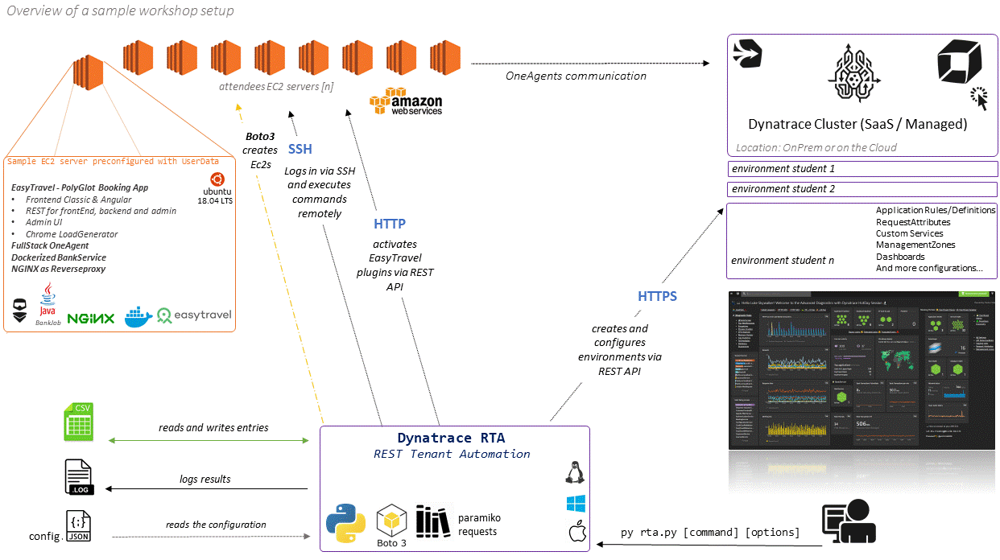
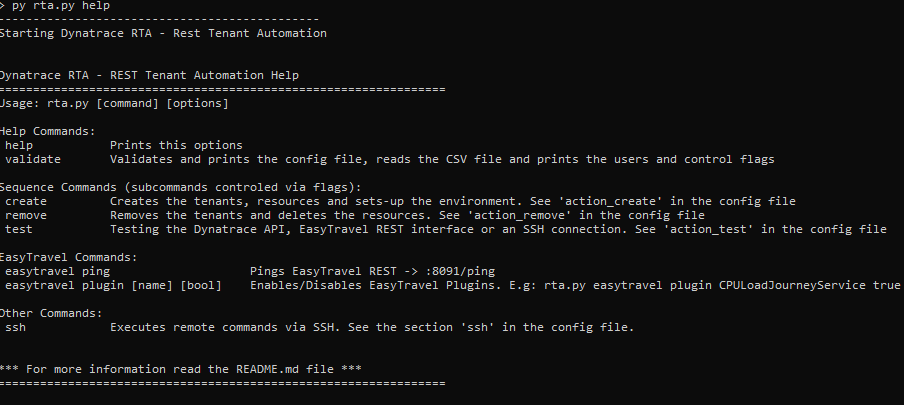

Python program that creates and automates environments via the Dynatrace API. This small program reads a CSV file and will execute for each entry the command called (or a sequence of commands). Each entry in the CSV file can be controled via flags `skiped=true` as well as the subcommands. The subcommands of the actions `create`, `remove` and `test` can be controled via flags defined in the `config.json` file. This program can work with a Managed Cluster and SaaS environments. 



## Prerequisites

- [python 3](https://www.python.org/downloads/)

- [A Dynatrace Tenant](https://www.dynatrace.com/trial/?gclid=Cj0KCQiAqNPyBRCjARIsAKA-WFzFj8-YaXYjzaY7uVGj0klG2KnGTs2WaQ8Wg3AI_Z8dX2Fzy9-fOy4aAu5IEALw_wcB)

- AWS account 
  
  > (optional for the ec2-actions) the program (boto3) will look into your `.aws` file for credentials. [Here you can get a free account](https://aws.amazon.com/free/)

## Features in a Nutshell

```properties
- Create environments with user and user_groups (Managed)
- Configure Dynatrace environments 
	- Create customized Dashboards for single users
	- Configure Applications and AppRules
	- Auto Tagging rules
	- Management Zones
	- Request Attributes
	- Custom Services
- Connect and execute commands via SSH 
- Enable EasyTravel problem patterns via REST
- Read and write entries in a CSV file
- Write results in JSON format
- Write action results back in the CSV file
	- results of the actions called
	- tenantId
	- ec2 instance id / publicIp / dns
	- tenant token
	- others...
- Logging
- Create an EC2 Instance with custom deployment 🔗 linked to each tenant
	- OneAgent bound to the tenant
  	- EasyTravel (8080/8079), Admin Console (8094) and Angular (9080) configured
- Remove the EC2 Instance and deactivate and remove the tenant.
- Manage the execution with commands via Control RowFlags (true/false) for each row:
	- skip - Skip the row for the actions
  	- isClusterAdmin - to add the User as a cluster admin
- Validate function to read the configuration and print the users in the CSV file. 
```

## Installing RTA

This commands will get you python, pip and the dependencies installed in your system.
```bash
sudo apt install python3

sudo apt install python3-pip

pip3 install -r requirements.txt
```

After you have installed them, just run `python3 rta.py help` for printing out the help.



## How does it work?

The `config.json` file:

about the status of the action as well as the id of the tenant, usergroup tenant token, ec2 instanceId, ec2 public dns, etc..

The file allows also other custom rows and will not modify them. when rewriting.


```bash
====== [RTA] Rest Tenant Automation Configuration ======
cmc:
 |-cmc_url     : https://xxxxx.dynatrace-managed.com 	The url of the cluster (when using Managed) with no leading slash
 |-cmc_token   : XXXXYYYYYZZZZ     		 	The API Token of the Cluster. Needed for creating tenants.

csv_dir   : csv					The csv directory to read/write files.
csv_file  : attendees.csv			The file to read for the actions called.
log_dir   : log					The log dir 
log_file  : rta.log				The log file
ssh:
 |-ssh_dir             : ssh		The SSH dir
 |-cmd_file            : cmd.sh		The shell file containing the commands to execute

aws:
 |-aws_dir             : aws			The AWS directory
 |-aws_config          : instance.json		The AWS configuration for creating EC2

action_test:
 |-tenant_api          : True			Will validate the tenant API with the apiToken
 |-ssh_connection      : True			Will validate the SSH connection
 |-easytravel_ping     : True			Will ping the REST Services of EasyTravel

action_create:
 |-create_tenant       : True			Will create the tenant on the Managed Cluster
 |-create_user_group   : True			Will create the userGroup (managed)
 |-create_user         : True			Will create the user (managed)
 |-create_allinone_token: True			Will create a paas and api token (managed/saas)
 |-create_ec2_instance : True			Will create an EC2 and install OneAgent
 |-fetch_ec2_instance  : True			Fetches the DNS/public IP of the EC2
 |-set_up_env          : True			Sets up the environment (See def set_up_environment(data))

action_remove:
 |-deactivate_tenant   : True			Deactivates the tenant (managed)
 |-remove_tenant       : True			Removes the tenant (managed)
 |-delete_user_group   : True			Deletes the user group (managed)
 |-delete_user         : True			Deletes the user
 |-delete_ec2_instance : True			Terminates the EC2 instance
```


## Control Flags

You can easily control for which entry to execute the actions called. You can controll this with the column `skip`

**skip** = empty and `false` equals `false`. Meaning the actions defined in the program (command and `config.json`) will be applied to that user. If it contains `True` then the user will be skipped.

**isClusterAdminGroup** = empty and `false` equals `false`. True will set the user_group for the user to cluster_admin in the creation of the environment. This user will have access to the CMC and to all tenants. This only applies for Managed.


## The CSV File (mandatory and optional fields for Managed and SaaS)

- ***The CSV is a semicolon ; separated file.***
- The **keys** are case **sensitive**
- The order of the fields is not important
- The program will keep the order when rewriting the results of the actions created. 
- The CSV may include as many other columns/key as necessary. 

After calling an action, rows with the result of the action will be added to the CSV file. For redundancy (for example if the CSV is opened in Excel or another program and can't be written) inside the `temp` folder a copy of the CSV file with the results will be written. The files will have as name the timestamp and `error` as prefix if an error occurred.  

| Key                 | Mandatory | default Value     | Description                                                  |
| ------------------- | --------- | ----------------- | ------------------------------------------------------------ |
| email               | yes       |                   | the Email of the person                                      |
| firstName           | yes       |                   | the firstname of the person (part of the tenant name)        |
| lastName            | yes       |                   | the lastname of the person (part of the tenant name)         |
| tenantId            | no        | will be generated | applies only for Managed                                     |
| skip                | no        | FALSE             | If found and if "true", the row will be skipped              |
| isClusterAdminGroup | no        | FALSE             | If found and if "true", the userGroup will be added as an cluster admin. |
| tenantId            | generated |                   | the tenantId for Managed                                     |
| tenantUrl           | yes       | generated         | for Managed it will be generated, for SaaS is mandatory with https protocol and no leading slash |
| tokenMmgt           | generated |                   | when creating an environment is the token for creation of API and PaaS tokens |
| apiToken            | yes       | generated         | for Managed it will be generated, for SaaS is mandatory when talking to the API. |
| paasToken           | yes       | generated         | for Managed it will be generated, for SaaS is mandatory when creating an EC2 instance where the OneAgent (or ActiveGate) should be installed. |
| publicDnsName       | no        |                   | when creating an EC2 instance this will be fetched.          |
| publicIpAddress     | no        |                   | when creating an EC2 instance this will be fetched.          |
| sshUser             | no        |                   | a DNS or IP address is needed.  The user for trying to connect via SSH (port 22) and execute remote commands |
| sshPassword         | no        |                   | a DNS or IP address is needed.  The password for trying to connect via SSH (port 22) and execute remote commands. Execute as `sudo` is also possible. |


## AWS 
The configuration of AWS is defined in a folder and in a JSON file specified in the `config.json` properties. In there you specify in which AWS region to create resources and the instance details for the creation.

### AWS Credentials
The program uses boto3, which is a library for managing aws resources. This will work automatically if you have AWS cli set up in your environment so you don't have to code it or enter it everytime.
[Here is how to set up your environment credentials](https://docs.aws.amazon.com/cli/latest/userguide/cli-chap-configure.html)
You can set them [programatically](https://boto3.amazonaws.com/v1/documentation/api/latest/guide/configuration.html), but I strongly advice to set them in your environment. 

### Creating Elastic Cloud Compute instances (EC2):

Be aware that the AMI instance IDs differ from one region to another, meaning an ubuntu has a different AMI ID for "Europe West" than "Europe East". 

```python
def customize_tags(tags, toReplace):
```
By default AWS has a limit of 20 multiple instances running. You might want to check up that limit in the region if you want to instantiate more than 20 ec2's.